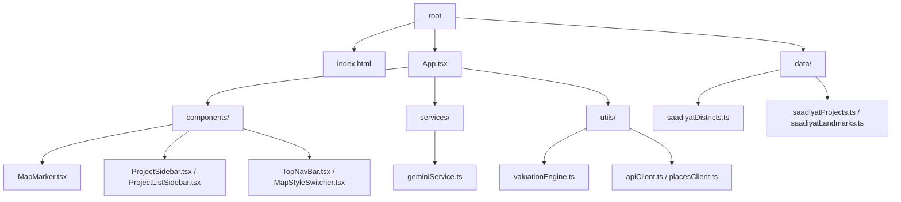
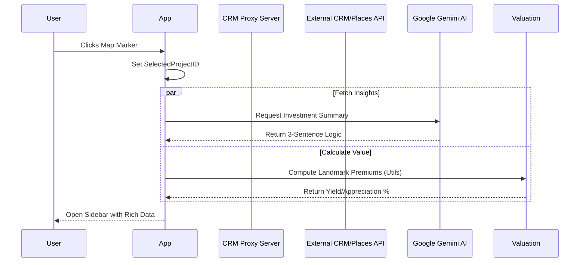
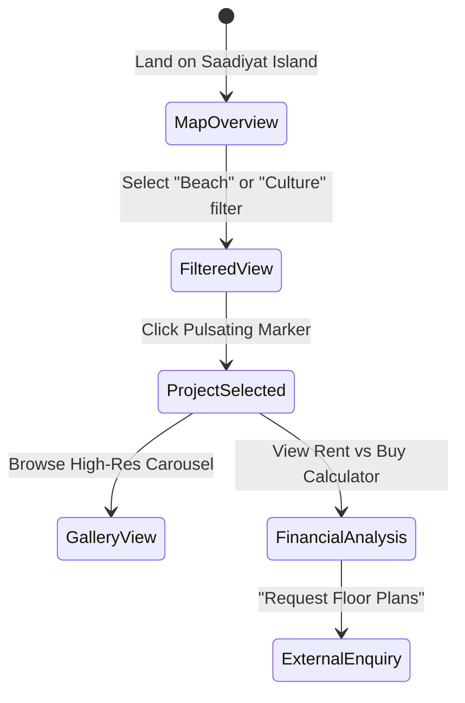

# 🏗️ PROJECT_MASTER: UAE Real Estate Explorer
**Internal Technical Documentation & Investor-Ready Specification**

---

## 1. 🧠 THE CORE PHILOSOPHY & VISION

### App Concept
The **UAE Real Estate Explorer** is a high-performance spatial intelligence platform designed to bridge the gap between abstract property listings and tangible investment value. It provides high-net-worth individuals (HNWIs) and institutional investors with a real-time, interactive environment to explore luxury developments in Abu Dhabi (specifically Saadiyat Island) and Dubai (Palm Jumeirah).

### The "Secret Sauce"
Unlike standard property portals (PropertyFinder, Bayut), this application employs a **Hybrid Valuation Intelligence** model:
1.  **Geo-Spatial Proximity Engine**: Automatically calculates "Landmark Premiums" based on real-time distances to cultural sites (Louvre Abu Dhabi), beaches, and lifestyle hubs.
2.  **Generative Sentiment Analysis**: Integrates **Google Gemini 3 Flash** to synthesize developer reputation, historical district growth, and current market trends into 3-sentence investment "verdicts."
3.  **Visual Tactility**: High-end UI/UX that prioritizes architectural photography and fluid spatial transitions to mimic the "premium feel" of the assets themselves.

### Target Audience
*   **International Investors**: Seeking high-yield assets in the UAE's tax-free environment.
*   **Wealth Managers**: Requiring quick, data-backed financial projections (Rent vs. Buy) for clients.
*   **Real Estate Developers**: Looking for a premium digital showroom for off-plan project launches.

---

## 2. 🏗️ ARCHITECTURE & TECH STACK

### Tech Stack
| Layer | Technology | Rationale |
| :--- | :--- | :--- |
| **Frontend** | React 18.3.1 (ESM) | Component-based architecture for high UI reusability. |
| **Mapping** | Mapbox GL JS v3.2.0 | Best-in-class performance for 3D terrain and custom GeoJSON layers. |
| **AI/LLM** | Google Gemini 3 Flash | Low-latency, high-reasoning model for financial insights. |
| **Styling** | Tailwind CSS | Utility-first styling for rapid design iteration and premium aesthetics. |
| **Backend (Proxy)** | Express.js | CORS management and API key masking for CRM/Places integration. |
| **State Management** | React Hooks (Memo/Callback) | Minimized re-renders during map movements and marker updates. |

### Directory Logic
*   `/components`: Atomic and molecular UI units (Markers, Sidebars, Nav).
*   `/data`: Local "Source of Truth" for landmarks and property fallbacks.
*   `/services`: External API communication (Gemini Service).
*   `/utils`: Pure functions for math (Haversine formula), pricing logic, and valuation engines.
*   `/crm-proxy-server`: A specialized microservice to handle secure API handshakes.

---

## 3. 🧩 LOGIC VISUALIZATION

### Project Tree

### Data Flow Diagram

### User Journey

---

## 4. 🛠️ FEATURE SPECIFICATIONS

### 1. Interactive Valuation Engine (`valuationEngine.ts`)
*   **Technical Logic**: Uses the **Haversine formula** to calculate the great-circle distance between property coordinates and landmark datasets. If distance < 500m, it applies a "Cultural District" multiplier to projected yields.
*   **Business Value**: Automates the "Location, Location, Location" rule, providing investors with immediate quantitative justification for premium prices.

### 2. High-Performance Marker UI (`MapMarker.tsx`)
*   **Technical Logic**: Markers are rendered as individual React components on top of the Mapbox canvas. Features `onMouseEnter` tooltips and a CSS-based `marker-pulse` animation on click.
*   **Business Value**: Increases engagement through tactile feedback; clarifies complex map clusters.

### 3. Investment Analysis Sidebar (`ProjectSidebar.tsx`)
*   **Technical Logic**: Aggregates three data streams: Static project specs, AI-generated sentiment, and Financial formulas.
*   **Business Value**: One-stop-shop for due diligence; reduces the time-to-decision for potential buyers.

---

## 5. 🗄️ DATA DICTIONARY & SCHEMA

### Entity: Project
| Field | Type | Description |
| :--- | :--- | :--- |
| `id` | String | Unique identifier (e.g., "saad-1"). |
| `name` | String | Commercial project name. |
| `latitude/longitude` | Number | WGS84 Decimal coordinates. |
| `type` | Enum | "villa" | "apartment". |
| `priceRange` | String | Formatted price (e.g., "AED 2.5M - 15M"). |
| `developerName` | String | Branding for developer trust. |

### Entity: ValuationResult
| Field | Type | Description |
| :--- | :--- | :--- |
| `appreciation` | String | Projected 3-year growth (e.g., "+28%"). |
| `yield` | String | Estimated rental return. |
| `isPremium` | Boolean | Flag for high-density luxury markers. |

---

## 6. 🚀 ROADMAP & UNIMPLEMENTED LOGIC

### Phase 2: Dynamic CRM Integration (Upcoming)
*   **Feature**: Real-time "Sold/Available" unit status via the `crm-proxy-server`.
*   **Logic**: Hooking into the CRM webhooks to update marker colors dynamically.

### Phase 3: AI-Powered Neighborhood Comparison (Upcoming)
*   **Feature**: Multi-project comparison view.
*   **Logic**: Using Gemini to compare two properties side-by-side based on square footage pricing and community amenities.

### Phase 4: AR Floor Plan Visualizer (Upcoming)
*   **Feature**: WebAR integration for selected projects.
*   **Logic**: Launching an 8th Wall or A-Frame session using the camera permission from `metadata.json`.

---
**Document Status**: `LIVING`
**Last Updated**: Current Session
**Owner**: CTO / Lead Technical Writer
