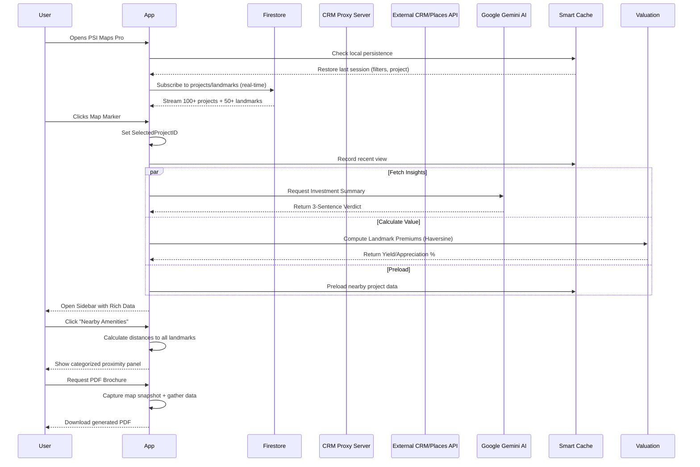
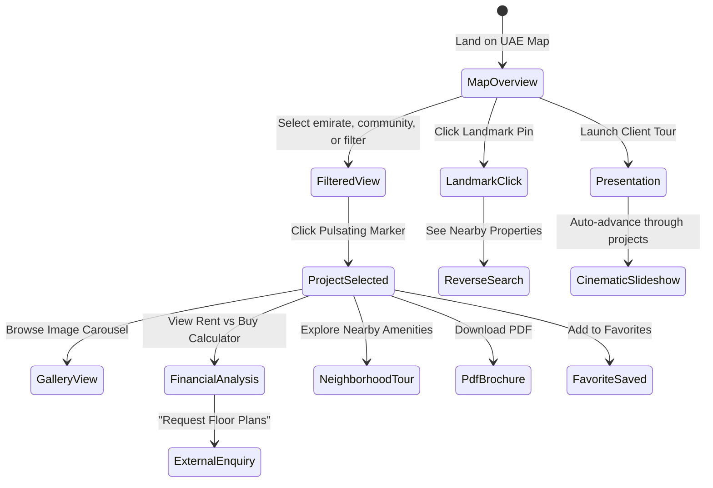

# 🏗️ PROJECT_MASTER: PSI Maps Pro — UAE Real Estate Intelligence Platform
**Internal Technical Documentation & Investor-Ready Specification**

---

## 1. 🧠 THE CORE PHILOSOPHY & VISION

### App Concept
The **PSI Maps Pro** is a high-performance spatial intelligence platform designed to bridge the gap between abstract property listings and tangible investment value. It provides high-net-worth individuals (HNWIs) and institutional investors with a real-time, interactive environment to explore luxury developments across the UAE (Abu Dhabi, Dubai, and all Emirates).

### The "Secret Sauce"
Unlike standard property portals (PropertyFinder, Bayut), this application employs a **Hybrid Valuation Intelligence** model:
1.  **Geo-Spatial Proximity Engine**: Automatically calculates "Landmark Premiums" based on real-time distances to cultural sites (Louvre Abu Dhabi), beaches, and lifestyle hubs — with Haversine formula accuracy.
2.  **Generative Sentiment Analysis**: Integrates **Google Gemini 3 Flash** to synthesize developer reputation, historical district growth, and current market trends into 3-sentence investment "verdicts."
3.  **Visual Tactility**: High-end UI/UX that prioritizes architectural photography, cinematic map transitions, and fluid spatial animations to mimic the "premium feel" of the assets themselves.
4.  **Smart Caching & Predictive Preloading**: Anticipates user navigation and preloads project data, images, and sidebar content before they're needed.
5.  **Neighbourhood Intelligence**: One-tap proximity analysis showing schools, hospitals, malls, hotels, and cultural landmarks within driving/walking distance.

### Target Audience
*   **International Investors**: Seeking high-yield assets in the UAE's tax-free environment.
*   **Wealth Managers**: Requiring quick, data-backed financial projections (Rent vs. Buy) for clients.
*   **Real Estate Developers**: Looking for a premium digital showroom for off-plan project launches.
*   **Property Sales Teams**: Using cinematic tour presentations for client pitches.

---

## 2. 🏗️ ARCHITECTURE & TECH STACK

### Tech Stack
| Layer | Technology | Rationale |
| :--- | :--- | :--- |
| **Frontend** | React 18.3.1 (ESM) | Component-based architecture for high UI reusability. |
| **Mapping** | Mapbox GL JS v3.2.0 | Best-in-class performance for 3D terrain, custom GeoJSON layers, and satellite view. |
| **AI/LLM** | Google Gemini 3 Flash | Low-latency, high-reasoning model for financial insights. |
| **Styling** | Tailwind CSS 3.4 | Utility-first styling for rapid design iteration and premium aesthetics. |
| **Backend (BaaS)** | Firebase (Firestore + Hosting) | Real-time NoSQL database with CDN-backed static hosting. |
| **Backend (Proxy)** | Express.js | CORS management and API key masking for CRM/Places integration. |
| **Cloud Functions** | Firebase Functions | Serverless backend for email services, push notifications. |
| **PDF Generation** | @react-pdf/renderer | In-browser brochure generation with map snapshots. |
| **State Management** | React Hooks (Memo/Callback) + Navigation Stack | Minimized re-renders with native iOS/Android-style back navigation. |
| **Performance** | Predictive Preloader + Smart Cache + Performance Engine | Anticipatory loading, IndexedDB persistence, Web Vitals monitoring. |
| **PWA** | Service Worker + Manifest.json | Native-grade app experience with install prompts, offline support, push notifications. |

### Directory Logic
*   `/components` (42 files): All UI components — markers, sidebars, modals, navigation, admin dashboard, AI chat, PDF renderer.
*   `/hooks` (6 files): Custom React hooks — device capabilities, favorites, map state, native gestures, navigation stack, project data.
*   `/utils` (23 files): Service layer — API clients, Firebase platform, caching, performance, image optimization, haptic feedback, predictive preloading, and more.
*   `/data` (8 files): Local seed data, placeholder fallbacks, and district GeoJSON boundaries.
*   `/scripts` (10+ files): CLI tools for auditing locations, batch optimizing images, enriching data, seeding Firestore, and scraping.
*   `/services` (1 file): Gemini AI service wrapper.
*   `/functions`: Firebase Cloud Functions for email services and push notifications.
*   `/crm-proxy-server`: A specialized microservice for secure CRM API handshakes.
*   `/public`: Static assets including PWA icons, manifest, service worker.

---

## 3. 🧩 LOGIC VISUALIZATION

### Project Tree

```mermaid
graph TD
    Root[root] --> IndexHTML[index.html]
    Root --> App[App.tsx]
    App --> Components[components/]
    Components --> MapMarkers[ProjectMarker.tsx]
    Components --> Sidebars[ProjectSidebar.tsx / ProjectListSidebar.tsx]
    Components --> Nav[TopNavBar.tsx / BottomControlBar.tsx]
    Components --> Carousel[FilteredProjectsCarousel.tsx]
    Components --> Admin[AdminDashboard.tsx]
    Components --> AIChat[AIChatAssistant.tsx]
    Components --> Nearby[NearbyPanel.tsx / PropertyResultsList.tsx]
    Components --> Modals[LandmarkInfoModal / FloorPlanModal / InquireModal]
    Components --> PWA[PWAInstallPrompt / PWAStatusOverlays]
    Components --> Presentation[PresentationShowcase / PresentationManager]
    Components --> PDF[pdf/ProjectPdfDocument.tsx]
    App --> Hooks[hooks/]
    Hooks --> UseProjectData[useProjectData.ts]
    Hooks --> UseMapState[useMapState.ts]
    Hooks --> UseNavStack[useNavigationStack.ts]
    Hooks --> UseGestures[useNativeGestures.ts]
    Hooks --> UseFavorites[useFavorites.tsx]
    Hooks --> UseDevice[useDeviceCapabilities.ts]
    App --> Utils[utils/]
    Utils --> Valuation[valuationEngine.ts]
    Utils --> API[apiClient.ts / placesClient.ts]
    Utils --> Cache[smartCache.ts / localPersistence.ts]
    Utils --> Perf[performanceEngine.ts / predictivePreloader.ts]
    Utils --> Firebase[firebase.ts / firebasePlatform.ts]
    Utils --> Networking[networkResilience.ts / backgroundSync.ts]
    Root --> Data[data/]
    Data --> GeoJSON[saadiyatDistricts.ts]
    Data --> SeedData[saadiyatProjects.ts / saadiyatLandmarks.ts]
    Data --> MasterData[master_projects.json — 500KB+]
    Root --> Scripts[scripts/]
    Scripts --> Audit[audit-locations.cjs]
    Scripts --> Optimize[batch-optimize.cjs]
    Scripts --> Enrich[enrich-data.cjs]
    Scripts --> Seed[seed-entities.cjs / seed-landmarks.cjs]
```

### Data Flow Diagram

```mermaid
sequenceDiagram
    participant User
    participant App
    participant Firestore
    participant Proxy as CRM Proxy Server
    participant CRM as External CRM/Places API
    participant Gemini as Google Gemini AI
    participant Cache as Smart Cache

    User->>App: Opens PSI Maps Pro
    App->>Cache: Check local persistence
    Cache-->>App: Restore last session (filters, project)
    App->>Firestore: Subscribe to projects/landmarks (real-time)
    Firestore-->>App: Stream 100+ projects + 50+ landmarks
    
    User->>App: Clicks Map Marker
    App->>App: Set SelectedProjectID
    App->>Cache: Record recent view
    par Fetch Insights
        App->>Gemini: Request Investment Summary
        Gemini-->>App: Return 3-Sentence Verdict
    and Calculate Value
        App->>Valuation: Compute Landmark Premiums (Haversine)
        Valuation-->>App: Return Yield/Appreciation %
    and Preload
        App->>Cache: Preload nearby project data
    end
    App-->>User: Open Sidebar with Rich Data

    User->>App: Click "Nearby Amenities"
    App->>App: Calculate distances to all landmarks
    App-->>User: Show categorized proximity panel

    User->>App: Request PDF Brochure
    App->>App: Capture map snapshot + gather data
    App-->>User: Download generated PDF
```

### User Journey

```mermaid
stateDiagram-v2
    [*] --> MapOverview: Land on UAE Map
    MapOverview --> FilteredView: Select emirate, community, or filter
    FilteredView --> ProjectSelected: Click Pulsating Marker
    ProjectSelected --> GalleryView: Browse Image Carousel
    ProjectSelected --> FinancialAnalysis: View Rent vs Buy Calculator
    ProjectSelected --> NeighborhoodTour: Explore Nearby Amenities
    ProjectSelected --> PdfBrochure: Download PDF
    FinancialAnalysis --> ExternalEnquiry: "Request Floor Plans"
    ProjectSelected --> FavoriteSaved: Add to Favorites
    MapOverview --> LandmarkClick: Click Landmark Pin
    LandmarkClick --> ReverseSearch: See Nearby Properties
    MapOverview --> Presentation: Launch Client Tour
    Presentation --> CinematicSlideshow: Auto-advance through projects
```

---

## 4. 🛠️ FEATURE SPECIFICATIONS (DELIVERED)

### 1. Interactive Valuation Engine (`valuationEngine.ts`)
*   **Technical Logic**: Uses the **Haversine formula** to calculate great-circle distance between property coordinates and landmark datasets. Applies "Cultural District" multiplier for sub-500m proximity.
*   **Business Value**: Automates "Location, Location, Location" — instant quantitative justification for premium prices.

### 2. High-Performance Marker UI (`ProjectMarker.tsx`)
*   **Technical Logic**: Markers rendered as React components with `onMouseEnter` tooltips, CSS `marker-pulse` animation, and smart clustering via `use-supercluster`.
*   **Business Value**: High engagement via tactile feedback; clarifies dense project areas.

### 3. Investment Analysis Sidebar (`ProjectSidebar.tsx` — 1,496 lines)
*   **Technical Logic**: Aggregates static specs, AI sentiment, financial formulas, image gallery (slideshow + lightbox), Mapbox directions, neighbourhood tour, and related projects.
*   **Features**: Image carousel with progress ring, play/pause slideshow, PDF brochure export, favorite/compare/share, directions calculator, amenity search, custom destination routing.
*   **Business Value**: One-stop-shop for due diligence; reduces time-to-decision.

### 4. Filtered Projects Carousel (`FilteredProjectsCarousel.tsx`)
*   **Technical Logic**: Horizontal snap carousel (mobile) / vertical list panel (desktop) with nearest-neighbour spatial sort, community grouping, cinematic tour engine with SVG progress ring, predictive preloading.
*   **Business Value**: Enables rapid visual browsing of filtered results.

### 5. Admin Dashboard (`AdminDashboard.tsx` — 110KB)
*   **Features**: Full CRUD for Projects, Landmarks, Communities, Cities, Developers. Visibility toggle (eye/hidden), coordinate review tool, banner settings, camera duration control, footer theme selector, client presentation manager.
*   **Business Value**: Non-technical team members can manage the entire platform.

### 6. AI Chat Assistant (`AIChatAssistant.tsx`)
*   **Technical Logic**: Google Gemini 3 Flash integration with contextual prompts based on selected project, community, and active filters. Triggers tours, applies filters, navigates to projects.
*   **Business Value**: Natural language property search and AI-powered investment guidance.

### 7. Neighbourhood Intelligence System
*   **Components**: `NearbyPanel.tsx`, `PropertyResultsList.tsx`, `LandmarkFactCard.tsx`
*   **Technical Logic**: Distance/drive time/walk time calculations with category grouping (Schools, Hospitals, Retail, Hotels, Culture, Leisure, Airports, Ports). Reverse search: click landmark → see nearby projects within 5km.
*   **Business Value**: Instant proximity analysis without leaving the map.

### 8. Client Presentation System
*   **Components**: `PresentationShowcase.tsx`, `PresentationManager.tsx`
*   **Technical Logic**: Configurable slideshow with custom project selections, adjustable intervals, cinematic camera movements, standalone `/presentation` route. Real-time Firestore sync.
*   **Business Value**: Sales teams create polished client presentations directly in the platform.

### 9. PDF Brochure Generator (`pdf/ProjectPdfDocument.tsx`)
*   **Technical Logic**: `@react-pdf/renderer` generates branded PDF with property specs, map snapshot (canvas capture), nearby amenities, and related projects. One-click download.
*   **Business Value**: Professional digital brochures generated on-demand.

### 10. Progressive Web App (PWA)
*   **Components**: `PWAInstallPrompt.tsx`, `PWAStatusOverlays.tsx`, Service Worker
*   **Features**: App install prompt, update banner, offline indicator, push notifications, app shortcuts (long-press icon for Search, Favorites, Chat), deep linking.
*   **Business Value**: Native-grade mobile experience without app store.

### 11. Favorites & Compare System (`FavoritesPanel.tsx`)
*   **Technical Logic**: localStorage-based persistence, heart toggle on cards, dedicated panel with side-by-side comparison.
*   **Business Value**: Shortlist and compare properties for decision-making.

### 12. Smart Performance Engine
*   **Services**: `performanceEngine.ts`, `predictivePreloader.ts`, `smartCache.ts`, `networkResilience.ts`, `backgroundSync.ts`
*   **Features**: Session restore, Web Vitals monitoring, proximity-based image preloading, IndexedDB caching, offline queue, progressive enhancement.
*   **Business Value**: Instant-feel UX even on slow connections.

### 13. Native Mobile UX (`useNativeGestures.ts`, `useNavigationStack.ts`)
*   **Features**: iOS/Android-style navigation stack with back-swipe, pull-to-refresh indicator, edge swipe detection, haptic feedback, safe area handling.
*   **Business Value**: Mobile users get a native app feeling.

### 14. Map Intelligence Tools
*   **Features**: 3D buildings toggle, map rotation, satellite/streets view, zoom controls, lasso selection, draw-to-filter polygon, community boundary overlays, heatmap mode, sunlight simulation, isochrone analysis.
*   **Business Value**: Professional-grade spatial analysis tools.

### 15. Welcome Banner (`WelcomeBanner.tsx`)
*   **Technical Logic**: Position-configurable (desktop + mobile), duration-adjustable, Firestore-synced visibility toggle.
*   **Business Value**: Customizable on-brand landing experience.

### 16. Email Services & Inquiries
*   **Components**: `InquireModal.tsx`, `ReportModal.tsx`
*   **Services**: `emailService.ts` via Firebase Cloud Functions
*   **Business Value**: Direct lead capture from the property view.

---

## 5. 🗄️ DATA DICTIONARY & SCHEMA

### Entity: Project
| Field | Type | Description |
| :--- | :--- | :--- |
| `id` | String | Unique identifier. |
| `name` | String | Commercial project name. |
| `latitude/longitude` | Number | WGS84 Decimal coordinates. |
| `type` | Enum | "villa" \| "apartment". |
| `priceRange` | String | Formatted price (e.g., "AED 2.5M - 15M"). |
| `developerName` | String | Developer branding. |
| `projectUrl` | String | External link to developer website. |
| `images` | String[] | Gallery image URLs. |
| `thumbnailUrl` | String | Optimized thumbnail for cards. |
| `optimizedGallery` | Object[] | `{thumb, large}` pairs for responsive media. |
| `bedrooms/bathrooms` | String \| Number | Unit specifications. |
| `builtupArea/plotArea` | String \| Number | Size in sqft. |
| `completionDate` | String | "Q3 2026" or ISO date. |
| `status` | String | "Off-Plan" \| "Completed". |
| `amenities` | String[] | Available amenities list. |
| `city/community/subCommunity` | String | Location hierarchy. |
| `isHidden` | Boolean | CMS visibility control. |
| `auditLatitude/auditLongitude` | Number | Mapbox-verified coordinates (audit system). |

### Entity: Landmark
| Field | Type | Description |
| :--- | :--- | :--- |
| `id` | String | Unique identifier. |
| `name` | String | Landmark name. |
| `latitude/longitude` | Number | WGS84 Decimal coordinates. |
| `category` | Enum | School \| Retail \| Culture \| Hospital \| Hotel \| Leisure \| Airport \| Port. |
| `community/city` | String | Location context. |
| `isHidden` | Boolean | CMS visibility control. |
| `thumbnailUrl/imageUrl` | String | Visual assets. |
| `images` | String[] | Multiple slideshow images. |
| `modelUrl` | String | URL to .glb/.gltf 3D model. |
| `domain` | String | Brand domain for logo (e.g., hilton.com). |
| `facts` | String[] | Animated slide-facts for LandmarkInfoModal. |

### Entity: ClientPresentation
| Field | Type | Description |
| :--- | :--- | :--- |
| `id` | String | Unique identifier. |
| `title` | String | Presentation name. |
| `projectIds` | String[] | Ordered list of project IDs. |
| `intervalSeconds` | Number | Auto-advance interval. |

### Entity: Developer / Community / City
| Field | Type | Description |
| :--- | :--- | :--- |
| Standard CRUD fields | Various | Name, description, images, tags, isHidden. |

---

## 6. 🚀 ROADMAP & UNIMPLEMENTED LOGIC

### Phase 2: Dynamic CRM Integration (Upcoming)
*   **Feature**: Real-time "Sold/Available" unit status via the `crm-proxy-server`.
*   **Logic**: Hooking into CRM webhooks to update marker colors dynamically.

### Phase 3: AI-Powered Neighborhood Comparison (Upcoming)
*   **Feature**: Multi-project comparison view with AI-generated side-by-side analysis.
*   **Logic**: Using Gemini to compare properties based on sq footage pricing and community amenities.

### Phase 4: AR Floor Plan Visualizer (Upcoming)
*   **Feature**: WebAR integration for selected projects.
*   **Logic**: Launching 8th Wall or A-Frame session using camera permissions.

### Phase 5: Isochrone & Lasso Tools (In Progress)
*   **Feature**: Drive-time boundaries and freehand polygon selection on the map.
*   **Logic**: Mapbox Isochrone API + Turf.js polygon intersection.

---
**Document Status**: `LIVING`
**Last Updated**: March 24, 2026
**Owner**: CTO / Lead Technical Writer
